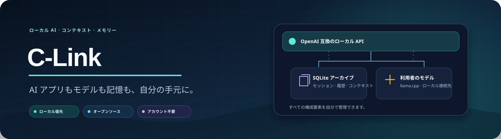
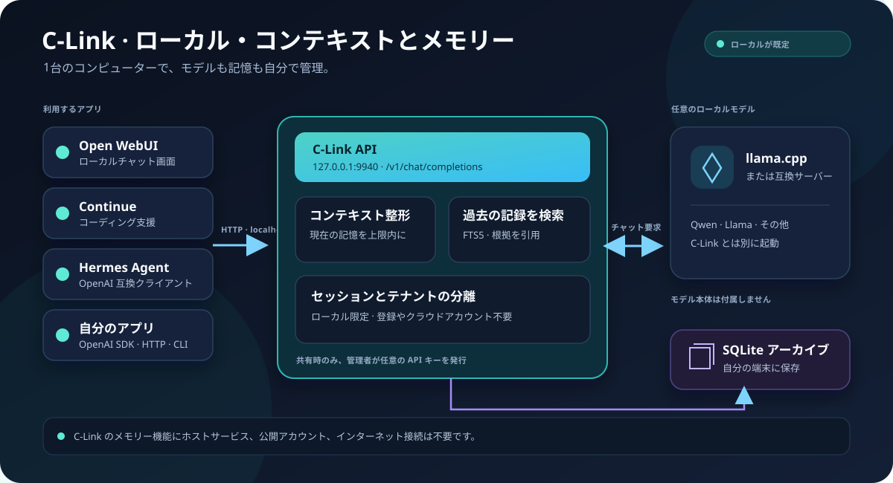
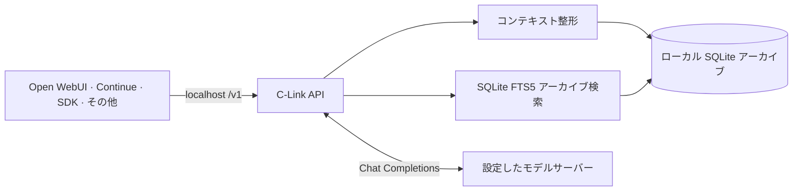
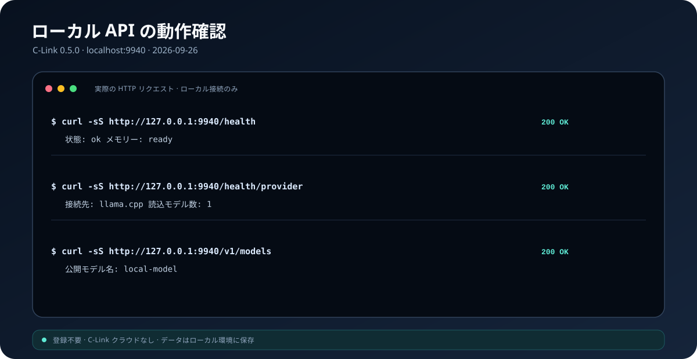

<div align="center">



<br/>

[ 🇬🇧 English ](README.md) &nbsp;|&nbsp; [ 🇯🇵 日本語 ](README.ja.md)

<br/>

[](https://python.org/)
[](https://fastapi.tiangolo.com/)
[](https://sqlite.org/)
[](docs/INTEGRATIONS.md)
[](#-ローカル優先の設計理由)
[](LICENSE)

<br/>

[](https://github.com/shafayatsaad)
[](https://www.linkedin.com/in/shafayatsaad/)
[](https://shafayatsaad.vercel.app/)

<br/>

<p>
  <b>C-Link</b> は AI アプリ向けのローカル優先コンテキスト・メモリーゲートウェイです。会話アーカイブを自分のコンピューターに保存し、リクエストごとに簡潔なコンテキストを組み立て、過去の会話から関連する根拠を検索できます。
</p>

<b>C-Link アカウント不要。サインアップ不要。C-Link ホストサービスなし。</b>

</div>

---

## 📋 目次

<details>
<summary><b>目次を表示</b></summary>

- [概要](#-概要)
- [主な機能](#-主な機能)
- [ローカル優先の設計理由](#-ローカル優先の設計理由)
- [アーキテクチャ](#️-アーキテクチャ)
- [セットアップ](#-セットアップ)
- [API とアプリ連携](#-api-とアプリ連携)
- [ローカル動作確認](#-ローカル動作確認)
- [データとプライバシー](#-データとプライバシー)
- [プロジェクト構成](#-プロジェクト構成)
- [テスト](#-テスト)
- [メンテナー](#-メンテナー)

</details>

---

## 🎯 概要

C-Link はアプリと OpenAI 互換モデル接続先の間で動作します。会話履歴を SQLite に保存し、モデル向けの小さな現在コンテキストを保ち、過去の根拠が必要な質問ではアーカイブを検索します。

既定では `127.0.0.1` にバインドし、同じコンピューター上からのみ API に接続できます。チャット生成には llama.cpp など、別途起動したモデルサーバーが必要です。メモリーとアーカイブ API はモデルサーバーなしでも動作します。

## ✨ 主な機能

- **ローカルメモリー:** セッション、メッセージ、コンテキストのスナップショット、検索結果をローカル SQLite に保存します。
- **上限付きコンテキスト:** アーカイブ全体を毎回送信せず、関連する小さなコンテキストを作成します。
- **過去の会話を検索:** SQLite FTS5 で以前のメッセージを検索し、根拠となる抜粋を返します。
- **OpenAI 互換チャット:** `/v1/chat/completions` で JSON または SSE ストリーミングを利用できます。
- **安定したセッション:** 固定の `session_id` または `X-C-Link-Session-Id` でアプリの会話を関連付けます。
- **モデルを選択可能:** ローカルまたは信頼できる OpenAI 互換 Chat Completions サーバーに接続します。
- **バックアップ:** CLI から SQLite バックアップの検証、作成、復元ができます。

モデルの重みと推論ランタイムは C-Link に含まれません。埋め込み、リポジトリ索引、ツール実行、MCP は現在の対象範囲外です。

## 🧭 ローカル優先の設計理由

| 設計 | 理由 |
| :--- | :--- |
| 既定でループバックに限定 | 個人利用にインターネット公開サービスやアカウントシステムは不要です。 |
| SQLite アーカイブ | 会話データはバックアップ・移動できるファイルに保存し、別の DB サーバーを必要としません。 |
| FTS5 の根拠検索 | ベクトル DB、埋め込みサービス、外部検索アカウントなしで過去を検索できます。 |
| 現在コンテキストに上限 | 会話全体は保存しながら、各ターンに必要な情報だけをモデルへ渡します。 |
| モデル接続を分離 | C-Link はコンテキストとメモリーを担当し、生成モデルは利用者が選択します。 |

チャット生成時には、設定したモデル接続先へリクエストが送られます。プロンプトを端末内に保つ場合はローカル接続先を使用してください。C-Link 自身が運用するクラウドや、メモリーを送信する C-Link サーバーはありません。

## 🏗️ アーキテクチャ





API とアーカイブはモデルサーバーなしでも動作します。チャット生成のみモデルサーバーが必要です。C-Link をリモートモデルに接続すると、そのサーバーへチャットリクエストとコンテキストが送信されます。既定のローカル構成では `127.0.0.1` を使用します。

## ⚡ セットアップ

### 必要なもの

- Python 3.12 以降
- チャット生成を使う場合は別途 OpenAI 互換 Chat Completions モデルサーバー（例: llama.cpp）

### Windows PowerShell

先にモデルサーバーを起動します。以下はポート `9931` で待ち受ける例です。

```powershell
Set-Location .
py -3.13 -m venv .venv
& .\.venv\Scripts\python.exe -m pip install -e .
$env:C_LINK_LLAMACPP_URL = "http://127.0.0.1:9931"
& .\.venv\Scripts\c-link.exe doctor --require-model
& .\.venv\Scripts\c-link.exe run --host 127.0.0.1 --port 9940
```

ターミナルを開いたままにします。`http://127.0.0.1:9940/docs` でローカル API ドキュメントを確認できます。アプリ用 API ベース URL は `http://127.0.0.1:9940/v1` です。

メモリー API のみ使う場合は `C_LINK_LLAMACPP_URL` を設定せず、`doctor --require-model` も省略して C-Link を起動します。チャットにはモデルサーバーが必要です。

### macOS / Linux

```bash
cd .
python3 -m venv .venv
. .venv/bin/activate
python -m pip install -e .
export C_LINK_LLAMACPP_URL=http://127.0.0.1:9931
c-link doctor --require-model
c-link run --host 127.0.0.1 --port 9940
```

Open WebUI、Continue、Hermes、OpenAI SDK の設定は[連携ガイド](docs/INTEGRATIONS.md)を参照してください。

## 🔌 API とアプリ連携

ローカル API ベース URL には `http://127.0.0.1:9940/v1`、モデル名には `local-model` を使用します。

| メソッド | パス | 用途 |
| :--- | :--- | :--- |
| `GET` | `/v1/models` | C-Link の公開モデル名を返す |
| `POST` | `/v1/chat/completions` | OpenAI 互換チャット、JSON または SSE |
| `POST` | `/v1/sessions` | 永続セッションを作成 |
| `GET` | `/v1/sessions` | ローカルセッションを一覧表示 |
| `GET` | `/v1/sessions/{id}/messages` | セッション履歴を取得 |
| `DELETE` | `/v1/sessions/{id}` | セッションを削除 |
| `GET` / `PUT` | `/v1/sessions/{id}/context` | 正規コンテキストを参照・更新 |
| `POST` | `/v1/context/compile` | 上限付きコンテキストを作成 |
| `POST` | `/v1/memory/query` | 現在のコンテキストと任意の過去根拠を検索 |

チャットリクエストの `memory_mode` は `auto`、`current`、`why`、`historical` に対応します。同じアーカイブを使う会話では、固定の `session_id` を指定します。リクエストとレスポンス、アプリ別の例は[連携ガイド](docs/INTEGRATIONS.md)にあります。

一つのローカルインスタンスを意図的に共有する場合、ホスト管理者向けの API キー付きテナント機能も使えます。CLI から作成し、公開登録やアカウントサービスはありません。個人のローカルインストールにテナント設定は不要です。

## ✅ ローカル動作確認

次の画像は、起動中のローカル C-Link API にリクエストを送り、サービス状態、モデル接続先、モデル一覧がすべて HTTP 200 を返すことを確認して作成しました。



通常の回帰テストを実行するには:

```powershell
Set-Location .
& .\.venv\Scripts\python.exe -m pytest
```

## 🔐 データとプライバシー

- 既定の保存先は `data/c_link.db` です。
- 通常のサーバーは `127.0.0.1` にバインドし、既定では他の端末から接続できません。
- サインアップ、ホストアカウント、テレメトリー、C-Link クラウド接続はありません。
- チャットのプロンプトは端末管理者が設定したモデルサーバーに送信されます。端末内に保つ場合はローカル接続先を使用してください。
- SQLite データは C-Link によって暗号化されません。端末とバックアップを保護してください。

## 📁 プロジェクト構成

```text
c-link/
├── README.md                 # English
├── README.ja.md              # 日本語
├── LICENSE                   # MIT
├── assets/                   # README バナー、構成図、動作確認画像
└── ./
    ├── pyproject.toml        # Python パッケージ設定
    ├── src/c_link/           # API、コンテキスト、保存、プロバイダー、CLI
    ├── tests/                # 回帰テスト
    ├── docs/INTEGRATIONS.md  # クライアント設定と API 詳細
    └── scripts/start.ps1     # Windows 起動補助
```

ローカルデータ、モデルファイル、非公開の作業コンテキスト、生成レポート、ベンチマーク用コードは GitHub のソース配布物に含めません。

## 🧪 テスト

通常のテストではコンテキスト作成、保存、API、テナント分離、プロバイダー、バックアップと復元を確認します。開発用依存関係を入れた後、`python -m pip install -e ".[dev]"` と `python -m pytest` を実行してください。

---

## 👤 メンテナー

<div align="center">

<a href="https://github.com/shafayatsaad">
  
</a>

<br/>

<strong>Shafayat Saad</strong>

<br/>

<sub>フルスタック開発者・AI/ML エンジニア</sub>

<br/><br/>

[](https://github.com/shafayatsaad)
[](https://www.linkedin.com/in/shafayatsaad/)
[](https://shafayatsaad.vercel.app/)

</div>

---

<div align="center">

**C-Link · ローカル AI メモリーを自分の手元に。**

</div>
