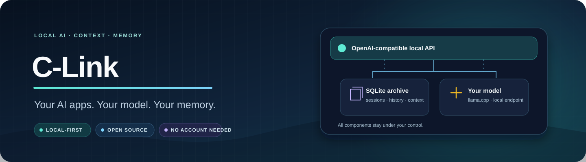
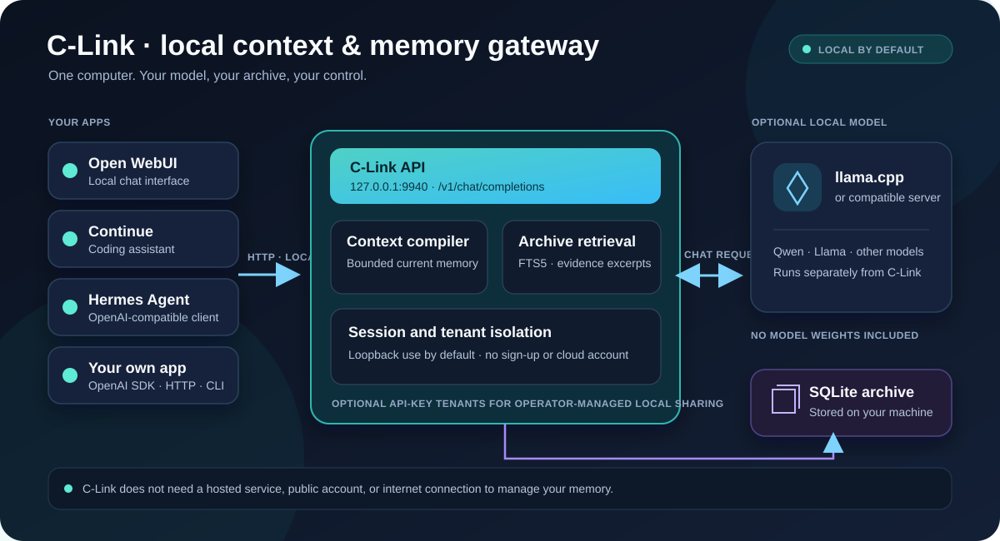
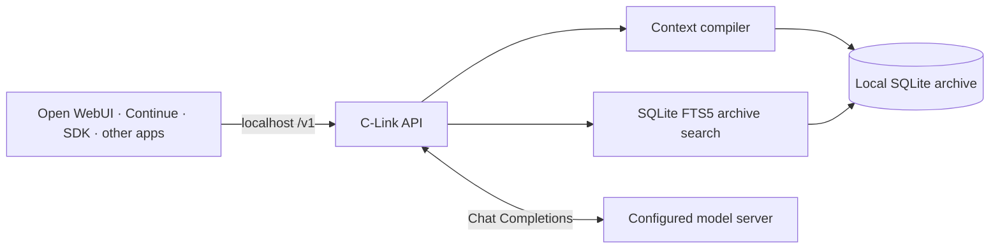
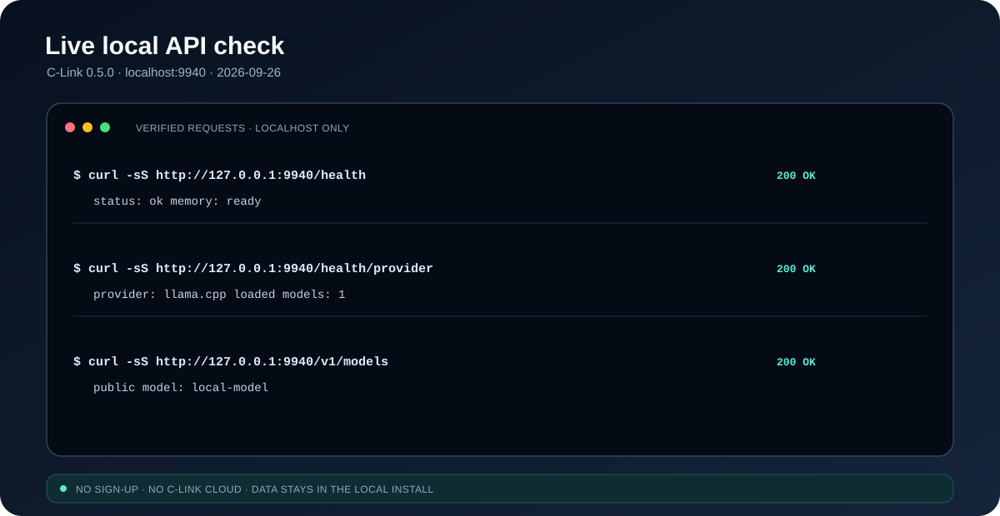

<div align="center">



<br/>

[ 🇬🇧 English ](README.md) &nbsp;|&nbsp; [ 🇯🇵 日本語 ](README.ja.md)

<br/>

[](https://python.org/)
[](https://fastapi.tiangolo.com/)
[](https://sqlite.org/)
[](docs/INTEGRATIONS.md)
[](#-why-local-first)
[](LICENSE)

<br/>

[](https://github.com/shafayatsaad)
[](https://www.linkedin.com/in/shafayatsaad/)
[](https://shafayatsaad.vercel.app/)

<br/>

<p>
  <b>C-Link</b> is a local-first context and memory gateway for AI apps. It keeps your conversation archive on your computer, builds compact context for each request, and can retrieve relevant evidence from earlier conversations.
</p>

<b>No C-Link account. No sign-up. No hosted C-Link service.</b>

</div>

---

## 📋 Contents

<details>
<summary><b>Open contents</b></summary>

- [Overview](#-overview)
- [Key features](#-key-features)
- [Why local-first](#-why-local-first)
- [Architecture](#️-architecture)
- [Getting started](#-getting-started)
- [API and integrations](#-api-and-integrations)
- [Local verification](#-local-verification)
- [Data and privacy](#-data-and-privacy)
- [Project structure](#-project-structure)
- [Tests](#-tests)
- [Maintainer](#-maintainer)

</details>

---

## 🎯 Overview

C-Link sits between your apps and an OpenAI-compatible model endpoint. It stores durable conversation history in SQLite, keeps a smaller active context for the model, and searches archived messages when a question needs historical evidence.

The default install binds to `127.0.0.1`, so the API is available only on the same computer. Chat generation uses a separate model server that you configure, such as llama.cpp. Memory and archive endpoints can run without a model server.

## ✨ Key features

- **Local memory:** sessions, messages, context snapshots, and retrieval records are stored in a local SQLite database.
- **Bounded context:** compile a small, relevant context packet without sending the full archive on every turn.
- **Historical recall:** search earlier messages with SQLite FTS5 and return excerpts as evidence.
- **OpenAI-compatible chat:** use `/v1/chat/completions` with regular JSON or streamed SSE responses.
- **Stable sessions:** associate app conversations with a stable `session_id` or `X-C-Link-Session-Id` header.
- **Portable model choice:** point C-Link at a local or otherwise trusted OpenAI-compatible Chat Completions server.
- **Backups:** verify, create, and restore SQLite backups from the CLI.

C-Link does not include model weights or an inference runtime. Embeddings, repository indexing, tool execution, and MCP are outside the current product scope.

## 🧭 Why local-first

| Design choice | Reason |
| :--- | :--- |
| Loopback by default | A personal install does not need an internet-facing service or an account system. |
| SQLite archive | Conversation data stays in a file the owner can back up and move; no database service is required. |
| FTS5 evidence search | Historical recall works without a vector database, embedding service, or external search account. |
| Bounded active context | The model receives the context needed for a turn while the full conversation remains archived. |
| Separate model provider | C-Link manages context and memory; the owner chooses which compatible model server handles generation. |

The model endpoint receives chat requests when chat generation is used. Choose a local endpoint to keep those prompts on-device. C-Link itself does not operate a cloud service or transmit memory to a C-Link server.

## 🏗️ Architecture





The API and archive can run without a model server. Only chat generation depends on one. If C-Link is pointed at a remote model endpoint, that endpoint will receive the chat request and context; the default local setup points to `127.0.0.1`.

## ⚡ Getting started

### Requirements

- Python 3.12 or newer
- A separately installed OpenAI-compatible Chat Completions model server for chat generation; for example, llama.cpp

### Windows PowerShell

Start your model server first. The example assumes it listens on port `9931`:

```powershell
Set-Location .
py -3.13 -m venv .venv
& .\.venv\Scripts\python.exe -m pip install -e .
$env:C_LINK_LLAMACPP_URL = "http://127.0.0.1:9931"
& .\.venv\Scripts\c-link.exe doctor --require-model
& .\.venv\Scripts\c-link.exe run --host 127.0.0.1 --port 9940
```

Keep the terminal running. Open `http://127.0.0.1:9940/docs` to view the local API documentation. The app API base URL is `http://127.0.0.1:9940/v1`.

To use only the memory APIs, start C-Link without setting `C_LINK_LLAMACPP_URL` and omit `doctor --require-model`; chat requests will need a model server.

### macOS / Linux

```bash
cd .
python3 -m venv .venv
. .venv/bin/activate
python -m pip install -e .
export C_LINK_LLAMACPP_URL=http://127.0.0.1:9931
c-link doctor --require-model
c-link run --host 127.0.0.1 --port 9940
```

See [Integrations](docs/INTEGRATIONS.md) for Open WebUI, Continue, Hermes, and OpenAI SDK configuration.

## 🔌 API and integrations

Use `http://127.0.0.1:9940/v1` as the local base URL and `local-model` as the model name.

| Method | Route | Purpose |
| :--- | :--- | :--- |
| `GET` | `/v1/models` | List C-Link's public model name |
| `POST` | `/v1/chat/completions` | OpenAI-compatible chat; JSON or SSE streaming |
| `POST` | `/v1/sessions` | Create a durable session |
| `GET` | `/v1/sessions` | List local sessions |
| `GET` | `/v1/sessions/{id}/messages` | Read session history |
| `DELETE` | `/v1/sessions/{id}` | Delete a session |
| `GET` / `PUT` | `/v1/sessions/{id}/context` | Read or update canonical context |
| `POST` | `/v1/context/compile` | Compile a bounded context packet |
| `POST` | `/v1/memory/query` | Query current context and optional historical evidence |

Chat requests support `memory_mode`: `auto`, `current`, `why`, and `historical`. Pass a stable `session_id` to keep turns in one archive. Full request/response details and app examples are in the [integration guide](docs/INTEGRATIONS.md).

Optional host-managed API-key tenants are available for someone who deliberately shares a local instance. This uses CLI provisioning; there is no public registration or account service. A personal local installation does not need tenant setup.

## ✅ Local verification

The following image was generated from successful requests to the running local C-Link API. It shows service health, model-provider health, and model discovery returning HTTP 200.



To run the regular regression suite:

```powershell
Set-Location .
& .\.venv\Scripts\python.exe -m pytest
```

## 🔐 Data and privacy

- C-Link stores conversation data in `data/c_link.db` by default.
- The normal server bind is `127.0.0.1`; it is not exposed to other devices by default.
- There is no sign-up, hosted account, telemetry service, or C-Link cloud endpoint.
- Chat prompts go to the model server configured by the machine owner. Keep it local if prompts must stay on-device.
- SQLite data is not encrypted by C-Link. Protect the device and any exported backups.

## 📁 Project structure

```text
c-link/
├── README.md                 # English
├── README.ja.md              # 日本語
├── LICENSE                   # MIT
├── assets/                   # README banner, architecture, and local proof images
├── pyproject.toml            # Installable Python package
├── src/c_link/               # API, context, storage, provider, CLI
├── tests/                    # Regression tests
├── docs/INTEGRATIONS.md      # Client setup and API details
└── scripts/start.ps1         # Windows local start helper
```

Local data, model files, private planning context, generated reports, and benchmark harnesses are not part of the GitHub source tree.

## 🧪 Tests

The standard suite covers context compilation, storage, API behavior, tenant isolation, provider handling, and backup/restore. Run it with `python -m pytest` after installing the development extra: `python -m pip install -e ".[dev]"`.

---

## 👤 Maintainer

<div align="center">

<a href="https://github.com/shafayatsaad">
  
</a>

<br/>

<strong>Shafayat Saad</strong>

<br/>

<sub>Full-Stack Developer &amp; AI/ML Engineer</sub>

<br/><br/>

[](https://github.com/shafayatsaad)
[](https://www.linkedin.com/in/shafayatsaad/)
[](https://shafayatsaad.vercel.app/)

</div>

---

<div align="center">

**C-Link · Local AI memory, under your control.**

</div>
